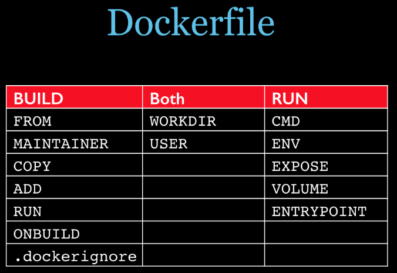

# docker
## 什么是docker？
- Docker是一个用于开发，交付和运行应用程序的开放平台是go语言编写的一个开源项目，基于C/S结构。
- 以**容器**的形式将您的应用程序及其所有依赖项打包在一起,以确保您的应用程序在任何环境都可以运行

### 优点：
1. 标准： Docker创建了容器的行业标准，因此它们可以在任何地方移植
2. 轻量级：容器共享计算机的OS系统内核，因此不需要每个应用程序都具有OS，从而提高了服务器效率并降低了服务器和许可成本
3. 安全：容器中的应用程序更安全，Docker提供了业界最强大的默认隔离功能

### 容器与虚拟机的区别?
- docker是容器，秒级别的实现
- 虚拟机实现的是分钟级别的
- 容器和虚拟机具有相似的资源隔离和分配优势，但功能不同，因为容器虚拟化了操作系统，而不是硬件。容器更加便携和高效


> hypervisor

- 虚拟机监视器：提供虚拟的作业平台来执行客体操作系统，负责管理其他客体操作系统的执行阶段；这些客体操作系统，共同分享虚拟化后的硬件资源。
- docker不需要Hypervisor实现硬件资源虚拟化,运行在docker容器上的程序直接使用的都是实际物理机的硬件资源。因此在CPU、内存利用率上docker将会在效率上有明显优势。
- docker利用的是宿主机的内核,而不需要Guest OS。因此,当新建一个容器时,docker不需要和虚拟机一样重新加载一个操作系统内核。

### 完全虚拟化和半虚拟化？
- 完全虚拟化（Full Virtualization) 需要**跑在宿主机之上**
  - 缺点：消耗资源大；优点：不需对客户机操作系统进行修改；
- 半虚拟化（Para Virtualization）直接**跑在硬件之上**
  - 缺点：需要对客户机操作系统进行修改，所以对不能修改的系统（windows系统）不支持；优点：消耗资源小性能好，

## Docker Engine

- Docker Engine在Docker 1.12及更高版本中支持**集群模式**


- server也称为守护进程`daemon process`：侦听Docker API请求并管理Docker对象。**所有守护程序都使用Docker API进行通信**
- API：它指定程序可以用来与守护程序进行通信并指示其操作的接口。
- CLI：命令行界面客户端

```
client可以和多个daemon之间通信。而且也可以是本地或者远程的
daemon之间可以互相通信
client和daemon之间的会话完成了docker的running 、 bullding、distributing（分发）容器的操作
```

- Docker Engine在Linux上使用以下名称空间：
  - 的**pid**命名空间：进程隔离（PID：进程ID）。
  - 该**net**命名空间：管理网络接口（NET：网络）。
  - 该**ipc**命名空间：管理访问IPC资源（IPC：进程间通信）。
  - 该**mnt**命名空间：管理文件系统挂载点（MNT：Mount）。
  - 该**uts**命名空间：隔离内核和版本标识符。（UTS：Unix时间共享系统）。

## Docker Architecture


- `IMAGES`:read-only template with instructions for creating a Docker container.只读模板，其中包含创建Docker容器的说明
- `CONTAINERS`:A container is a runnable instance of an image.	容器是图像的可运行实例。
  - Docker API or CLI用来create, start, stop, move, or delete。
  - connect a container to one or more networks,默认情况下，容器与其他容器及其主机之间的隔离程度相对较高。
- `docker registry`：docker的注册表存储Docker映像
- `repository`:集中存放镜像文件的场所
  - 仓库(Repository)和仓库注册服务器(Registry) 是有区别的。
  - 仓库注册服务器(Registry)上往往存放着多个仓库，每个仓库中又包含了多个镜像,每个镜像有不同的标签(tag)。
- `Control groups`：Linux上的Docker Engine还依赖于另一种称为控制组 （cgroups）的技术。cgroup将应用程序限制为一组特定的资源。控制组允许Docker Engine将可用硬件资源共享给容器，并可以选择强制实施限制和约束。例如，您可以限制特定容器可用的内存。

> 重点

1. 默认容器格式为**libcontainer**
2. 使用`docker pull`或`docker run`命令时，将从配置的注册表中提取所需的图像。
3. 使用`docker push`命令时，会将映像推送到已配置的注册表。


> 执行过程案例
> docker run -i -t ubuntu /bin/bash

1. 如果您在ubuntu本地没有该映像，则Docker将从您配置的注册表(register)中提取该映像，就好像您是docker pull ubuntu手动运行的一样。
2. Docker会创建一个新容器，就像您已docker container create 手动运行命令一样。
3. Docker将一个读写文件系统分配给容器，作为其最后一层。这允许运行中的容器在其本地文件系统中创建或修改文件和目录。
4. Docker创建了一个网络接口以将容器连接到默认网络，因为您未指定任何网络选项。这包括为容器分配IP地址。默认情况下，容器可以使用主机的网络连接连接到外部网络。
5. Docker启动容器并执行/bin/bash。因为容器是交互式运行的，并且已附加到您的终端（由于-i和-t 标志），所以您可以在输出记录到终端时使用键盘提供输入。
6. 当您键入exit以终止/bin/bash命令时，容器将停止但不会被删除。您可以重新启动或删除它。

## docker Command

命令|作用
:--:|:--
`docker version`|docker 版本,以及一些信息
`docker info`|docker的信息描述,docker更详细
`attach `|Attach to a running container                 # 当前 shell 下 attach 连接指定运行镜像
`build`|Build an image from a Dockerfile              # 通过 Dockerfile 定制镜像
`commit`|Create a new image from a container changes   # 提交当前容器为新的镜像
`cp`|Copy files/folders from the containers filesystem to the host path   #从容器中拷贝指定文件或者目录到宿主机中
`create`|Create a new container                        # 创建一个新的容器，同 run，但不启动容器
`diff`|Inspect changes on a container's filesystem   # 查看 docker 容器变化
`events`|Get real time events from the server          # 从 docker 服务获取容器实时事件
`exec`|Run a command in an existing container        # 在已存在的容器上运行命令
`export`|Stream the contents of a container as a tar archive   # 导出容器的内容流作为一个 tar 归档文件[对应 import ]
`history `|Show the history of an image                  # 展示一个镜像形成历史
`images`|List images                                   # 列出系统当前镜像
`import`|Create a new filesystem image from the contents of a tarball # 从tar包中的内容创建一个新的文件系统映像`[对应export]`
`info`|Display system-wide information               # 显示系统相关信息
`inspect`|Return low-level information on a container   # 查看容器详细信息
`kill`| Kill a running container                      # kill 指定 docker 容器
`load`|Load an image from a tar archive              # 从一个 tar 包中加载一个镜像[对应 save]
`login `|Register or Login to the docker registry server    # 注册或者登陆一个 docker 源服务器
`logout `|Log out from a Docker registry server          # 从当前 Docker registry 退出
`logs`| Fetch the logs of a container                 # 输出当前容器日志信息
`port `|Lookup the public-facing port which is NAT-ed to PRIVATE_PORT    # 查看映射端口对应的容器内部源端口
`pause`|Pause all processes within a container        # 暂停容器
`ps`|List containers                               # 列出容器列表
`pull`|Pull an image or a repository from the docker registry server   # 从docker镜像源服务器拉取指定镜像或者库镜像
`push`|Push an image or a repository to the docker registry server    # 推送指定镜像或者库镜像至docker源服务器
`restart`|Restart a running container                   # 重启运行的容器
`rm`| Remove one or more containers                 # 移除一个或者多个容器
`rmi`|Remove one or more images             # 移除一个或多个镜像[无容器使用该镜像才可删除，否则需删除相关容器才可继续或 -f 强制删除]
`run`|Run a command in a new container              # 创建一个新的容器并运行一个命令
`save`|Save an image to a tar archive                # 保存一个镜像为一个 tar 包[对应 load]
`search`|Search for an image on the Docker Hub         # 在 docker hub 中搜索镜像
`start`|Start a stopped containers                    # 启动容器
`stop`|Stop a running containers                     # 停止容器
`tag`|Tag an image into a repository                # 给源中镜像打标签
`top`|Lookup the running processes of a container   # 查看容器中运行的进程信息
`unpause`|Unpause a paused container                    # 取消暂停容器
`version`|Show the docker version information           # 查看 docker 版本号
`wait`| Block until a container stops, then print its exit code   # 截取容器停止时的退出状态值


> 注意

- Docker容器后台运行,就必须有一个前台进程.
- 容器运行的命令如果不是那些一直挂起的命令（比如运行top，tail），就是会自动退出的。
- 比如nginx正常情况下,我们配置启动服务只需要启动响应的service即可。例如`service nginx start`但是,这样做,nginx为后台进程模式运行,就导致docker前台没有运行的应用,这样的容器后台启动后,会立即自杀因为他觉得他没事可做了.所以，最佳的解决方案是,将你要运行的程序以前台进程的形式运行

## docker 镜像
- 一种轻量级、可执行的独立软件包，用来打包软件运行环境和基于运行环境开发的软件，它包含运行某个软件所需的所有内容，包括代码、运行时、库、环境变量和配置文件。

### 联合文件系统UnionFS
- 分层、轻量级并且高性能的文件系统
- 支持对文件系统的修改作为一次提交来一层层的叠加
- 不同目录挂载到同一个虚拟文件系统下
-  Docker 镜像的基础
- **特点**:
  - 一次同时加载多个文件系统，但从外面看起来，只能看到一个文件系统，联合加载会把各层文件系统叠加起来，这样最终的文件系统会包含所有底层的文件和目录

### 镜像加载原理
1. 文件系统为UnionFS
2. bootfs(boot file system)主要包含bootloader和kernel
   1. bootloader主要是引导加载kernel
3. Docker镜像的最底层是bootfs,Linux启动时先加载bootfs
4. rootfs (root file system) ，在bootfs之上。包含的就是典型 Linux 系统中的 /dev, /proc, /bin, /etc 等标准目录和文件


对于一个精简的OS，rootfs可以很小，只需要包括最基本的命令、工具和程序库就可以了，因为底层直接用Host的kernel，自己只需要提供 rootfs 就行了。

由此可见对于不同的linux发行版, bootfs基本是一致的, rootfs会有差别, 因此不同的发行版可以公用bootfs。

- docker镜像都是只读的
- 当一个容器启动时,一个新的可写层被加载到镜像的顶部,这层称之为'容器层'.'容器层'之下的都是'镜像层'

`docker commit -m="提交的描述信息" -a="作者" 容器id 要创建的镜像名字[:标签名]`

## docker容器数据卷

- 有点类似redis的aof和rdb文件
- 作用
  - 容器的持久化
  - 容器间继承+共享数据

### 数据卷

> 容器内添加

`docker run -it -v /宿主机目录:/容器内目录 centos /bin/bash`
-  `-v /宿主机目录:/容器内目录[:rw]`默认方式
-  `-v /宿主机目录:/容器内目录[:ro]`以只读方式


- `docker inspect 容器ID`可以查看是否挂载成功(作用:查看容器内部细节)
- 容器停止后,修改数据仍然同步

> DockerFile添加

`VOLUME["/dataVolumeContainer","/dataVolumeContainer2","/dataVolumeContainer3"]`

容器中添加3个,
- 默认挂载主机目录为`/var/lib/docker/volumes/50feacce2ca8fa56f0b168191c8e684fa8216761f2ba7927c0ee9536171e45a4/_data`(随机的)
- 默认是`"RW": true,`
- name是`"Name": "50feacce2ca8fa56f0b168191c8e684fa8216761f2ba7927c0ee9536171e45a4"`

Docker挂载主机目录Docker访问出现cannot open directory .: Permission denied

解决办法：在挂载目录后多加一个--privileged=true参数即可

### 数据卷容器

- 命名的容器挂载数据卷，其它容器通过挂载这个(父容器)实现数据共享，挂载数据卷的容器，称之为数据卷容器
- `--volumes-from`
  - `docker run -it --name dc02 --volumes-from dc01 zzyy/centos`将dc01作为父容器共享dc01中的数据卷
  
容器之间的配置信息的传递,数据卷的生命周期一直持续到没有容器使用它为止


## DockerFile

- 构建步骤
  1. 构建dockerfile
  2. docker build
  3. docker run

> 注意

1. 每个指令都必须全部大写且后面必须至少一个参数
2. 指令从上到下执行
3. #表示注释
4. 每条指令都会创建新的镜像层,并提交

### Docker File指令

指令|作用
:--:|:--
`FROM`|指明基础镜像
`MAINTAINER`|镜像维护者的名字和邮箱地址
`RUN`|容器构建时需要运行的命令
`EXPOSE`|当前容器对外暴露的端口
`WORKDIR`|指定在创建容器后,终端默认登录的工作目录
`ENV`|设置环境变量
`ADD`|将宿主机的文件拷贝进镜像且ADD会自动处理URL和解压缩tar包
`COPY`|类似ADD,但是不处理
`VOLUME`|容器卷的操作
`CMD`|可以有多个CMD,但是只有最后一个有效,且CMD会被docker run后的参数替换
`ENTRYPOINT`|指定一个容器启动是要运行的命令,和CMD类似
`ONBUILD`|当被继承时,父镜像触发





## 本地镜像上阿里


### 案例

> DockerFile内容

```dockerfile
FROM centos
VOLUME ["/dataVolumeContainer1","/dataVolumeContainer2"]
CMD echo "finished,--------success1"
CMD /bin/bash
```

构建镜像`docker build -f /home/w/mydocker/Dockerfile -t wangyu/centos:1.0 .`

- `-f` 制定文件路径
- `-t` 镜像名

[阿里云镜像搜索](https://promotion.aliyun.com/ntms/act/kubernetes.html)


`denied: requested access to the resource is denied`错误
  - `docker login registry.cn-hangzhou.aliyuncs.com`然后输入账号和密码,得到解决

> push

- `docker tag  hello-world:latest  registry.cn-hangzhou.aliyuncs.com/wychj/hello:1.0`更换标签
- `ddocker push registry.cn-hangzhou.aliyuncs.com/wychj/hello:1.0`直接push到仓库
  - `registry.cn-hangzhou.aliyuncs.com/wychj`是仓库名称,必须提前更换标签


---

---

---
# mysql的部署

- ` docker pull centos/mysql-57-centos7`
- `docker run -d --name=mysql -p 33306:3306 -e MYSQL_ROOT_PASSWORD=wangyu mysql:5.7`
- `mysql -h 127.0.0.1 -P33306 -uroot -pwangyu`

指定目录的安装

`docker run -d --name=mysql -p 33306:3306 --restart always --privileged=true -v /home/w/dockerService/mysql/conf:/etc/mysql -v /home/w/dockerService/mysql/logs:/var/log/mysql -v /home/w/dockerService/mysql/data:/var/lib/mysql -e MYSQL_ROOT_PASSWORD=wangyu  mysql:5.7`

- `–restart always`：开机启动
- `–privileged=true`：提升容器内权限（false可能会因权限导致无法启动）

grant all privileges  on *.* to root@'%' identified by "password";

flush privileges;

mysql -uroot -pwangyu -h localhost -P33306

# TOmcat部署

- `docker pull tomcat:8.0.20-jre8`
- `docker run -di --name=wangyuTomcat -p 8888:8080 -v /home/w/webapps:/usr/local/tomcat/webapps tomcat:8.0.20-jre8`

# Redis部署

- `docker pull redis`
- `docker run -p 6379:6379 --name redis -v /home/w/dockerService/redis/redis.conf:/etc/redis/redis.conf -v /home/w/dockerService/redis/data:/data -d redis redis-server /etc/redis/redis.conf`
  1. `-p 6378:6379`  容器redis 端口6379 映射 宿主机未6378
  2. `--name redis` 容器 名字 为 redis
  3. `-v /home/w/dockerService/redis/redis.conf:/etc/redis/redis.conf `  容器 /etc/redis/redis.conf 配置文件 映射宿主机 /home/w/dockerService/redis/redis.conf。  会将宿主机的配置文件复制到docker中。<br/>**重要： 配置文件映射，docker镜像redis 默认无配置文件。**
  4. `-v /home/w/dockerService/redis/data:/data`  容器 /data 映射到宿主机 /home/w/dockerService/redis/data,存放log,aof,rdb文件
  5. `-d redis ` 后台模式启动 redis 
  - `redis-server /etc/redis/redis.conf`   redis 将以 /etc/redis/redis.conf 为配置文件启动
  - `--appendonly yes`  开启redis 持久化<br/>**重要:  docker 镜像reids 默认 无配置文件启动**

docker exec -it redis redis-cli

**daemonize=NO**。非后台模式，如果为YES 会的导致 redis 无法启动，因为后台会导致docker无任务可做而退出。


# 迁移与备份

1. 容器保存为镜像
   1. `docker commit `
2. 镜像备份
   1. `docker save -o xxx.tar 镜像id`
3. 镜像恢复与迁移
   1. `docker load -i xxx.tar`
      1. `-i`表示输入的文件


---

---


# docker运行springboot

```
w@wangyu:~/mydocker$ ls
Dockerfile  springbootone-0.0.1-SNAPSHOT.jar  wangyu.txt
w@wangyu:~/mydocker$ cat Dockerfile 
FROM openjdk:8-jdk
COPY springbootone-0.0.1-SNAPSHOT.jar /
ENTRYPOINT ["java","-jar","/springbootone-0.0.1-SNAPSHOT.jar"]
w@wangyu:~/mydocker$ docker build -f /home/w/mydocker/Dockerfile -t springboot/springbttest:1.0 .
w@wangyu:~/mydocker$ docker logs -f --tail=10  1a0f3dde25a1 >wangyu.txt
^C
```

jdk1.8镜像构建
```dockerfile
FROM centos:7
MAINTAINER WANG
#切换工作目录
WORKDIR /usr
RUN mkdir /usr/local/java
ADD jdk.tar.gz /usr/local/java/

ENV JAVA_HOME /usr/local/java/jdk1.8
ENV JRE_HOME $JAVA_HOME/jre
ENV CLASSPATH $JAVA_HOME/lib/dt.jar;$JAVA_HOME/lib/tools.jar;$JRE_HOME/lib:$CLASSPATH
ENV PATH $JRE_HOME/lib:$PATH

```

## maven插件方式

> 启动docker远程连接

- `sed -ri 's#^ExecStart.*#ExecStart=/usr/bin/dockerd -H tcp://0.0.0.0:2375 -H unix:///var/run/docker.sock#' /lib/systemd/system/docker.service`
- `systemctl daemon-reload`
- `systemctl restart docker`
- `docker start 7cdab63da5e1`

> pom.xml配置

```xml
<build>
		<finalName>app</finalName>
		<plugins>
			<plugin>
				<groupId>org.springframework.boot</groupId>
				<artifactId>spring-boot-maven-plugin</artifactId>
			</plugin>
			<plugin>
				<groupId>com.spotify</groupId>
				<artifactId>docker-maven-plugin</artifactId>
				<version>0.4.13</version>
				<configuration>
					<!--生成镜像的名称-->
					<imageName>127.0.0.1:5000/${project.artifactId}:${project.version}</imageName>
					<!--类似dockerfile中的FROM-->
					<baseImage>openjdk:8-jdk</baseImage>
					<!--入口点:运行java -jar /app.jar-->
					<entryPoint>["java","-jar","/${project.build.finalName}.jar"]</entryPoint>
					<resources>
						<resource>
							<!--相当于 ADD app.jar /-->
							<targetPath>/</targetPath>
							<directory>${project.build.directory}</directory>
							<include>${project.build.finalName}.jar</include>
						</resource>
					</resources>
					<!--docker主机-->
					<dockerHost>http://127.0.0.1:2375/</dockerHost>
				</configuration>
			</plugin>
		</plugins>
	</build>
```

## docker删除私有仓库
- `delete_docker_registry_image.py` 
- `alias docker-delete-image='sudo /home/w/tools/delete_docker_registry_image.py'`

## rancher

- docker的图形化管理界面

### 安装

- `docker pull rancher/server`
- `docker run -di --name=rancher -p 9090:8080 rancher/server`
  
## gogs
### gogs搭建
- `docker pull gogs/gogs`
- `docker run -id --name=gogs [-p 10022:22] -p 3000:3000 -v /home/w/dockerService/gogs/data:/data gogs/gogs`
- 10022是用ssh连接,连不上

---

## influxDB

分布式时间序列数据库.仅仅显示实时信息,但是不存储监视数据,需要cadvisor组件提供的监视信息

- `docker pull tutum/influxdb`
- `docker run -fi -p 8080:8083 -p 8086:8086 --expose 8090 --expose 8099 --name influxsrv tutum/influxdb`
  - 8083是web访问端口
  - 8086是写入端口

## cAdvisor

监控docker容器,不需要任何配置就可以监控正在运行在宿主机上的容器

- `docker pull google/cadvisor`
- `docker run --volume=/:rootfs:ro --volume=/var/run:/var/run:rw --volume=/sys:/sys:ro --volume=/var/lib/docker/:/var/lib/docker:ro --publish=8080:8080 --detach=true --link influxsrv:influxsrv --name=cadvisor google/cadvisor -storage_driver=influxdb -storage_driver_db=cadvisor -storage_driver_host=influxsrv:8086`

web:http://ip:8080/containers

- Grafana:数据可视化


---
docker run -d -p 5000:5000 --restart always --privileged=true  --name=registry -v /home/w/dockerResitry:/var/lib/registry registry
