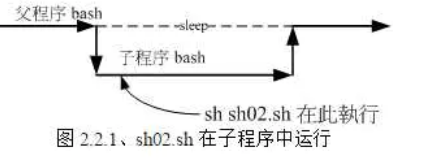
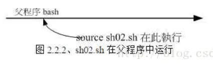
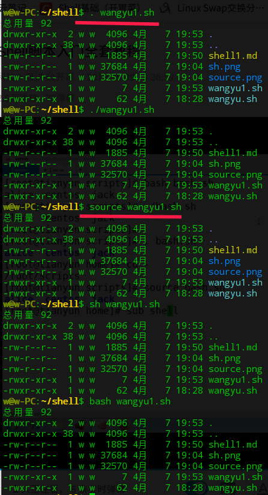
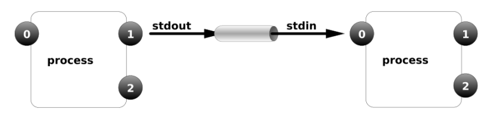

# Shell 1 day
## 作用：
1. 自动化初始化
2. 自动化软件的部署
3. 管理应用程序
---
## bash基础
### shell 相关
1. `#!/usr/bin/bash` shebang，shell脚本的第一行解释，定义程序用那个解释器执行。
   - 如果不写，可以通过`bash xx.sh`，明确指定的方式执行.**能**通过绝对路径执行
   - 如果写错了，可以通过`bash xx.sh`明确执行定的方式执行，**不能**通过绝对路径执行
   - `#!/usr/bin/python`可以通过绝对路径的方式执行.py的文件（`必须是.py`）
   - `shell有多个，/user/bin/bash和/bin/bash都是shell的一种。`***cat /etc/shells***可查看所有shell
2. `usermod -s /bin/bash 用户名`给用户一个/bin/bash的shell，用于登录
3. `login shell与nologin shell`
   - `su - 用户名`表示`login shell`，加载用户的环境
   - `su 用户名` 表示`noloing shell`

```
用户目录中：
   ~/.bash_history用户离开才会执行。将历史命令写入到里面
   ~/.bash_logout用户离开才会执行。自动执行此shell
   ~/.bashrc用户登录后执行(login shell  nologin shell)。
   ~/.bash_profile 用户登录后执行(login shell)。
系统级别中：
   /etc/profile用户登录后执行(login shell)。
   /etc/bashrc用户登录后执行(login shell  nologin shell)。通过profile中定义：
      if [ -f /etc/bash.bashrc ]; then
         . /etc/bash.bashrc
      fi   

```

4. shell执行方式的区别
   -  `bash xx.sh`启用一个子shell执行。
   -  `./xx.sh`启用一个子shell执行。<font color=red>只有它需要执行权限</font>
   -  `sh xx.sh`启用一个子shell执行。没有执行权限也可以执行<br/>调试模式：
      -  仅调试语法错误 ：`sh -n xx.sh`
      -  调试方式查看整个过程： `sh -vx xx.sh`
   -  `source xx.sh`表示当前shell中执行。没有执行权限也可以执行
   -  `. xx.sh`表示当前shell中执行。



### GNU常见命令
 `bash-completion`此包装了，则自动补齐tab键（/bin/bash的shell中。就是GNUshell）

|                GNU命令                 | 作用                                                                 |
| :------------------------------------: | :------------------------------------------------------------------- |
|                  `!$`                  | 表示上一次使用的路径。                                               |
|                  `!!`                  | 上一个命令。                                                         |
|                `alias`                 | 当前shell的别名。                                                    |
|          `alias wangyu='sl'`           | 临时别名当前shell有效，跑小火车。                                    |
|            `unalias wangyu`            | 取消别名。                                                           |
|               `\wangyu`                | 临时一次取消别名                                                     |
|                `ctrl+R`                | 搜索历史命令，根据输入的值进行搜索                                   |
|                `ctrl+D`                | 退出shell                                                            |
|                `ctrl+K`                | shell中，删除光标**后面**的所有                                      |
|                `ctrl+Y`                | shell中,恢复刚刚删除的                                               |
|                `ctrl+U`                | shell中，删除光标**前面**的所有                                      |
|                `ctrl+A`                | shell中，移动光标到最前                                              |
|                `ctrl+E`                | shell中，移动光标到最后                                              |
|                `ctrl+S`                | 锁屏，但是命令可以执行                                               |
|                `ctrl+Q`                | 解除锁屏                                                             |
|                `命令 &`                | 在后台执行                                                           |
|                `screen`                | `screen -list`查出id，然后`screen -r id`可以恢复到原先的终端         |
|                 `jobs`                 | 可以查看后端进程                                                     |
|                `Ctrl+C`                | 强制中断程序的执行。前端中断                                         |
|                `Ctrl+Z`                | 将任务中断,但是此任务并没有结束,他仍然在进程中他只是维持挂起的状态   |
|                 `jobs`                 | 可用查出后台的任务                                                   |
|                `fg和bg`                | fg命令重新启动前台被中断的任务<br/>bg命令把被中断的任务放在后台执行. |
|              `id 用户名`               | 可以查看用户名，如用户存在`$?`为0，否则为非0                         |
| `seq [StratNum[,Increment]]lastNumber` | 生成一个序列化                                                       |
|         `touch filexx{1..$w}`          | touch 不能引用变量                                                   |
ssh-keygen -P "" -f ~/.ssh/id_rsa|指定位置生成公钥


### IO
|  命令  |               输入输出解释                |
| :----: | :---------------------------------------: |
|   0    |                标准输入流                 |
|   1    |                标准输出流                 |
|   2    |                标准错误流                 |
|  `<`   |               0，输入重定向               |
|  `>`   |              `1`，输出重定向              |
|  `>>`  |              `>`的基础上追加              |
|  `2>`  |            `2`，错误输出重定向            |
| `2>>`  |                   追加                    |
| `2>&1` | `2->1` 表示将标准错误流重定向到标准输出流 |
|  `&>`  |   `12`混合输出。标准输出和标准错误输出    |

1. `$?`变量表示上一个命令执行返回的结果，
   - 如果为**0**表示成功
   - 如果为**非0** 表示失败
   - echo $?
2. `EOF`语法
    - 作用就是可以将换行的内容输入
    - ```cat << EOF 内容 EOF``` 语法格式
    - 特殊：当 ```<<-EOF ```有个-，表示后面的EOF可以缩进
    - ```cat <<-EOF > 文件  内容1.2.3.。。EOF```可以把多行`(1)`重定向输出到文件中

### 管道命令



**特征**
1. 先进先出
2. 临时存在
3. 匿名管道不能夸终端
4. 本质是一个文件

|          命令           |                                    管道                                     |
| :---------------------: | :-------------------------------------------------------------------------: |
| `输出的命令 | tee 文件` |         与 `输出的命令 > 文件`相似，<br/>但是它会在屏幕打印输出信息         |
|           `&`           |     表示任务在后台执行，如要在后台运行redis-server,则有  redis-server &     |
|          `&&`           |    表示前一条命令执行成功时，才执行后一条命令 ，如 echo '1‘ && echo '2'     |
|           `|`           |        表示管道，上一条命令的输出，作为下一条命令参数，如 echo 'yes'        | wc -l |
|          `||`           |          表示上一条命令执行失败后，才执行下一条命令，如 cat nofile          |       | echo "fail" |
|      `命令1;命令2`      | 命令1;命令2，先执行命令1，在执行命令2.<br/>无论失败与否，都会执行这另个命令 |
mkfifo 文件.fifo|创建一个管道文件

---

### 文件句柄
命令|作用
:--:|:--
fd|文本句柄(文件描述符)<br/>定义:当文件打开时给它的一个数字标示,就是fd<br/><font color=red>ls -l /proc/$$/fd</font>可以查看所有的fd
exec fd编号<> 文件|生成一个文件句柄
exec fd编号>&-|删除一个文件句柄
exec fd编号<&-|删除一个文件句柄
cp /proc/$$/fd/66 文件路径|可以恢复文件(文件句柄还在)


### shell通配符
|  命令  |                         作用                          |
| :----: | :---------------------------------------------------: |
|  `*`   |                     匹配多个字符                      |
|  `?`   |                      匹配1个字符                      |
|  `[]`  |         类似于正则的[]，括号中的任意一个字符          |
|  `()`  |                    在子shell中执行                    |
|  `{}`  |           集合 touch file{1..4}创建4个文件            |
| `echo` | `echo -e "\e[1;35m 35 是粉色 \e[0m 颜色重置"`重置颜色 |


### vim输入模式的快捷键

|       命令       |            作用            |
| :--------------: | :------------------------: |
|      CTRL+E      |     插入光标下方的字符     |
|      CTRL+Y      |     插入光标上方的字符     |
| CTRL-M 或 CTRL-J |  开始新行。跟enter没区别   |
|      CTRL+A      |     插入上次插入的文本     |
|      CTRL+@      | 表示CTRL+A并且退出输入模式 |
|      CTRL-U      |    删除当前行的所有字符    |
|      CTRL-W      |       删除前面的单词       |
|      CTRL-T      |       当前行首的缩进       |
|      CTRL-I      |         光标处缩进         |
|      CTRL-D      |      删除当前行首缩进      |
|      CTRL-Z      |   退到后台，fg命令可恢复   |
|      CTRL-S      |    锁屏幕，Ctrl+Q可恢复    |
| CTRL-P或者CTRL-N |         关键字补齐         |

