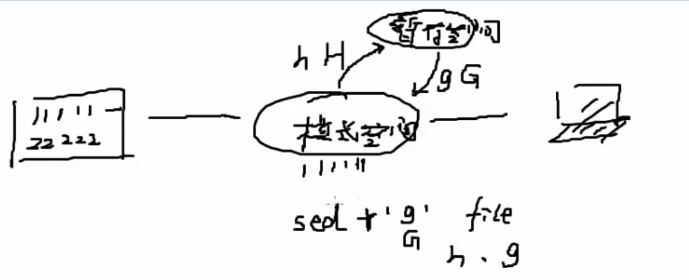

# 正则表达式
## 基础语法
基本的正则元字符|作用
:--:|:--
`grep支持`|-
`^`|行首定位符
`$`|行尾定位
`.`|匹配单个字符 l..e 
`*`|匹配前导符 0 到多次 ab*love
`.*` |任意多个字符.贪婪匹配
`[]`|匹配指定范围内的一个字符 [lL]ove
`[^]`|匹配不在指定组内的字符 [^a-z0-9]ove
`\`|用来转义元字符 love\. 
`\<` |`<加上转义`词首定位符 \<love 
`\>` |`>加上转义`词尾定位符 love\> 
`\(..\)`|`()加上转义`.匹配稍后使用的字符的标签
`x\{m,n\}`|字符x出现最少m最多n 次

扩展正则表达式元字符|作用
:--:|:--
`egrep支持`|-
`+`| 匹配一个或多个前导字符 [a-z]+ove 
`?`| 匹配零个或一个前导字符 lo?ve 
`a|b`| 匹配 a 或 b love|hate
`()`| 组字符 loveable|rs love(able|rs) ov+ (ov)+
`(..)(..)\1\2`| 标签匹配字符 (love)able\1er--->loveableloveer
`x{m}`| 字符 x 重复 m 次 o{5} 
`x{m,}`| 字符 x 重复至少 m 次 o{5,}
`x{m,n}`| 字符 x 重复 m 到 n 次 o{5,10}

常用|作用
:--:|:--
匹配数字:|`^[0-9]+$`<br/>`123 456 5y7`
匹配 Mail|`[a-z0-9_]+@[a-z0-9]+\.[a-z]+ `<br/>`yangsheng131420@126.com`
匹配 IP|` [0-9]{1,3}\.[0-9]{1,3}\.[0-9]{1,3}\.[0-9]{1,3}`
grep过滤#|`cat ~/.bashrc | grep "^[^#]"`或`cat ~/.bashrc | grep -v "^#"`

**vim的匹配**
常用|作用
:--:|:--
`%s /oleChar/newChar/g`|将旧字符替换成新的字符./g表示全局
`%s /wo(shi)shei/w/1s/g`|将woshishei替换成wshis./g表示全局
`%s/wang/&x/g`|将全局匹配wang,并替换成wangx
---
## grep家族
- grep:在文件中全局查找指定的正则表达式
- egrep:扩展的egrep,支持扩展的正则表达式元字符
- fgrep:不支持正则(fixed grep)

**支持元字符**
- grep:`^,$,.,*,[],[^],\<\>,\(\),\{\},\|,\+`
- egrep:`?,+,{},|,()`


**命令格式**
grep [选项] 模式 文件1....

选项|作用
:--:|:--
`-q`|`grep -q "^root" /etc/passwd ;echo $?`<br/>与`grep "^root" /etc/passwd &> /dev/null ;echo $?`结果差不多,当passwd文件不存在时候是不一样的
`grep -E`|等价egrep
`-i`|忽略大小写
`-c`|显示成功匹配的的行数
`-v`|反向查找,显示不匹配的
`-R,-r`|递归
`--color`|颜色
`-n`|显示所在的行数

---
## sed
- sed 是一种在线的、非交互式的编辑器，它一次处理一行内容。处理时，把当前处理的行存储在临时缓冲区中，称为“<font color=red>模式空间</font>”（pattern space），接着用 sed 命令处理缓冲区中的内容，处理完成后，把缓冲区的内容送往屏幕。接着处理下一行，这样不断重复，直到文件末尾。
- 文件内容并没有改变，除非你使用重定向存储输出。
- Sed 主要用来自动编辑一个或多个文件；简化对文件的反复操作；编写转换程序等
- 默认不支持扩展元字符,添加以下任意则支持
  1. `\+`
  2. `sed -r`


**语法格式**
- sed [options] 'command' file(s)
- sed [options] -f scriptfile file(s)
- <font color=red>sed 和 grep 不一样，不管是否找到指定的模式，它的退出状态都是 0</font><br/><font color=yellow>当只有语法错误的时候才是非0</font>

'options'|作用
:--:|:--
`-r`|支持正则扩展
`-n`|原先的内容不输出,类似于grep -q的作用
`-e `|允许多项编辑
`-f`|指定 sed 脚本文件名
`-i`|inplace，就地编辑

'地址(command)'|作用
:--:|:--
`d`|逐行删除.什么都不打印
`3d`|只删除第三行
`2,4d`|删除2~4行
`2,$d`|删除2~尾行
`p`|打印,会多打印一行
`/root/p`|打印有root的行
`sed '/bin\/bash/p' passwd`|打印bin/bash的一行,(第二个/需要转义,否则报错,查找的话可以任意字符替换/但是必须转义,查找替换的话可以任意字符替换/)<br/>比如:`sed '#bin\#bash#p' passwd`
`sed '\#sync#,$d' passwd`|从sync行开始,到最后一行,都删除
`sed '\#sync#,＋３d' passwd`|从sync行开始,再增加３行,都删除
`sed '1~2d' passwd`|从第一行开始,每隔2行删除,就是删除奇数行
`sed '0~2d' passwd`|从第0行开始,每隔2行删除,就是删除偶数行
`s`|查找替换
`a` |在当前行后添加一行或多行
`c` |用新文本修改（替换）当前行中的文本
`d` |删除行
`i` |在当前行之前插入文本
`l` |列出非打印字符
`p` |打印行
`n` |读入下一输入行，并从下一条命令而不是第一条命令开始对其的处理
`q` |结束或退出 sed
`!`| 对所选行以外的所有行应用命令
`r`| 从文件中读
`w`| 将行写入文件
`h`| 把模式空间里的内容复制到暂存缓冲区(**覆盖**)
`H`| 把模式空间里的内容**追加**到暂存缓冲区
`g`| 取出暂存缓冲区的内容，将其复制到模式空间，**覆盖**该处原有内容
`G`| 取出暂存缓冲区的内容，将其复制到模式空间，**追加**在原有内容后
`x`| 交换暂存缓冲区与模式空间的 




s有两个特殊的标记-g 全局替换-i 忽略大小写

**案例**
```
w@wangyu:~/shell/day3$ sed '' passwd 
root:x:0:0:root:/root:/bin/bash
daemon:x:1:1:daemon:/usr/sbin:/usr/sbin/nologin
bin:x:2:2:bin:/bin:/usr/sbin/nologin
sys:x:3:3:sys:/dev:/usr/sbin/nologin
sync:x:4:65534:sync:/bin:/bin/sync
games:x:5:60:games:/usr/games:/usr/sbin/nologin
man:x:6:12:man:/var/cache/man:/usr/sbin/nologin
lp:x:7:7:lp:/var/spool/lpd:/usr/sbin/nologin
mail:x:8:8:mail:/var/mail:/usr/sbin/nologin
news:x:9:9:news:/var/spool/news:/usr/sbin/nologin

w@wangyu:~/shell/day3$ sed '3,7d' passwd 
root:x:0:0:root:/root:/bin/bash
daemon:x:1:1:daemon:/usr/sbin:/usr/sbin/nologin
lp:x:7:7:lp:/var/spool/lpd:/usr/sbin/nologin
mail:x:8:8:mail:/var/mail:/usr/sbin/nologin
news:x:9:9:news:/var/spool/news:/usr/sbin/nologin

w@wangyu:~/shell/day3$ sed 'd' passwd 

w@wangyu:~/shell/day3$ sed '1d' passwd 
daemon:x:1:1:daemon:/usr/sbin:/usr/sbin/nologin
bin:x:2:2:bin:/bin:/usr/sbin/nologin
sys:x:3:3:sys:/dev:/usr/sbin/nologin
sync:x:4:65534:sync:/bin:/bin/sync
games:x:5:60:games:/usr/games:/usr/sbin/nologin
man:x:6:12:man:/var/cache/man:/usr/sbin/nologin
lp:x:7:7:lp:/var/spool/lpd:/usr/sbin/nologin
mail:x:8:8:mail:/var/mail:/usr/sbin/nologin
news:x:9:9:news:/var/spool/news:/usr/sbin/nologin

w@wangyu:~/shell/day3$ sed '\#sync#,$d' passwd
root:x:0:0:root:/root:/bin/bash
daemon:x:1:1:daemon:/usr/sbin:/usr/sbin/nologin
bin:x:2:2:bin:/bin:/usr/sbin/nologin
sys:x:3:3:sys:/dev:/usr/sbin/nologin


w@wangyu:~/shell/day3$ sed 's/root/wangyu/g' passwd 
wangyu:x:0:0:wangyu:/wangyu:/bin/bash

w@wangyu:~/shell/day3$ sed 's/root/wangyu/' passwd 
wangyu:x:0:0:root:/root:/bin/bash

w@wangyu:~/shell/day3$ sed 's/Root/wangyu/gi' passwd 
wangyu:x:0:0:wangyu:/wangyu:/bin/bash
```
## sed扩展
### sed地址
- 地址用于决定那些行进行编辑.地址可以是数字,正则表达式或者二合一
- 没有制定地址,则输出所有行

> 详情参考上面command

### sed command
**案例**
```
前面添加#
sed -r 's@(.*)@#\1@' passwd 
sed -r 's@^@#@' passwd
sed -r 's@^@#&@' passwd 
sed -r 's@.*@#&@' passwd
前面删除#
sed -r 's/#//g' passwd 
在每行第二个前面加yy
 sed -r 's@(.)@&yy@' passwd 
 sed -r 's#(.)(.*)#\1yy\2#g' passwd
在第二行中插入/etc/hosts文件的内存
sed -r '2r /etc/hosts' passwd
将第一行的内容保存到wan.txt文件中
sed -r "2w wan.txt" passwd
将sync的下一行,进行d命令
sed -r "/sync/{n;d}" passwd 
将第一行移动到最后一行
sed -r '1{h;d};$G' passwd 
将第一行与最后一行替换
sed -r '1{h;d};$g' passwd 
```

---
## awk
- awk 的处理文本和数据的方式是这样的，它逐行扫描文件，从第一行到最后一行，寻找的特定模式的行，并在这些行上进行你想要的操作
- 默认的分隔符是空格或制表符(tab).使用-F ""来明确指定分隔符
```
awk 'BEGIN{FS=":"} {print $1}' passwd 
awk -F ":" '{print $1}' passwd
```

**语法格式**
- awk [options] 'commands' filenames
- awk [options] -f awk-script-file filenam

**命令格式**
- awk '正则模式' filename
- awk '{action}' filename
- awk '正则模式 {action}'filename
- command | awk '正则模式 {action}'

### command
```
BEGIN{} {} END{}
行处理前 行处理 行处
$awk 'BEGIN{print "wang"} {print $1} END{print "-----"}' /etc/hosts ;echo $?
$awk 'BEGIN{FS=":";OFS="---------"} {print $1,$2}' passwd 
root---------x
daemon---------x
bin---------x
sys---------x
sync---------x
games---------x
man---------x
lp---------x
mail---------x
news---------x

```
### 工作原理
1. )awk 使用一行作为输入，并将这一行赋给内部变量$0，每一行也可称为一个记录，以换行符结束
2. 然后，行被:（默认为空格或制表符）分解成字段（或域），每个字段存储在已编号的变量中，从$1 开始，最多达 100 个字段
- awk 如何知道用空格来分隔字段的呢？ 因为有一个内部变量 FS 来确定字段分隔符。初始时，FS **赋为空格**
3. awk 打印字段时，将以设置的方法使用 print 函数打印，awk 在打印的字段间加上空格，因为$1,$3 之间有一个逗号。逗号比较特殊，它映射为另一个内部变量，称为输出字段分隔符 OFS，OFS 默认为空格
4. awk 输出之后，将从文件中获取另一行，并将其存储在$0 中，覆盖原来的内容，然后将新的字符串分隔成字段并进行处理。该过程将持续到所有行处理完毕

**记录与字段相关内部变量**
变量|作用
:--:|:--
`$0`| awk 变量$0 保存当前记录的内容 <br/> `awk -F: '{print $0}' /etc/passwd`
`NR`|The **total number** of input records seen so far. <br/>` awk -F: '{print NR, $0}' /etc/passwd /etc/hosts`
`FNR`| The input record number in the **current input file**<br/> `awk -F: '{print FNR, $0}' /etc/passwd /etc/hosts`
`NF`|保存记录的**字段数**，$1,$2...$100 <br/> ` awk -F: '{print $0,NF}' /etc/passwd`
`FS`| 输入字段分隔符，默认空格 <br/> ` awk -F: '/alice/{print $1, $3}' /etc/passwd`<br/> ` awk -F'[ :\t]' '{print $1,$2,$3}' /etc/passwd` <br/> ` awk 'BEGIN{FS=":"} {print $1,$3}' /etc/passwd`
`OFS`| 输出字段分隔符 <br/> ` awk -F: '/alice/{print $1,$2,$3,$4}' /etc/passwd`<br/> ` awk 'BEGIN{FS=":"; OFS="+++"} /^root/{print $1,$2,$3,$4}' /etc/passwd`
`RS`| The input record separator(记录分隔符), by default a newline. <br/> ` awk -F: 'BEGIN{RS=" "} {print $0}' a.txt`
`ORS`| The output record separator, by default a newline. <br/> ` awk -F: 'BEGIN{ORS=""} {print $0}' passwd`

- FS\OFS\RS\ORS区别
  1. FS\OFS默认是空格或者制表符
  2. RS\oRS默认是换行

### 格式化输出
- print
  - 无法格式,只能输出
- printf `案例:# awk -F: '{printf "%-15s %-10s %-15s\n", $1,$2,$3}' /etc/passwd`
  - `%s` 字符串类型 
  - `%d` 数值类型
  - `%f` 浮点数
  - `-` 表示左对齐
  - `数字` 表示占多少个字符
  - `\n` 表示换行符

### 模式
#### 正则表达式
- 匹配字段：匹配操作符（~ !~)

```
awk -F: '$1 ~ /^alice/' /etc/passwd
awk -F: '$NF !~ /bash$/' /etc/passwd
```

#### 比较表达式
- 用于比较数字与字符串
  
运算符|含义|实例
:--:|:--|:--
`<`|小于 |`x<y`
`<=`| 小于或等于|`x<=y`
`==` |等于|`x==y`
`!=` |不等于|`x!=y`
`>=` |大于等于|`x>=y`
`> `|大于|`x>y`

```
# awk -F: '$3 == 0' /etc/passwd
# awk -F: '$3 < 10' /etc/passwd
# awk -F: '$7 == "/bin/bash"' /etc/passwd
# awk -F: '$1 == "alice"' /etc/passwd
# awk -F: '$1 ~ /alice/ ' /etc/passwd
# awk -F: '$1 !~ /alice/ ' /etc/passwd
# df -P | grep '/' |awk '$4 > 2500
```
#### 条件表达式
```
# awk -F: '$3>300 {print $0}' /etc/passwd
# awk -F: '{ if($3>300) print $0 }' /etc/passwd
# awk -F: '{ if($3>300) {print $0} }' /etc/passwd
# awk -F: '{ if($3>300) {print $3} else{print $1} }' /etc/pass
```
#### 算术运算：+ - * / %(模) ^(幂 2^3)
- 可以在模式中执行计算awk 都将按浮点数方式执行算术运算

```
# awk -F: '$3 * 10 > 500' /etc/passwd
# awk -F: '{ if($3*10>500){print $0} }' /etc/pass
```
#### 逻辑操作符和复合模式
运算符|作用|案例
:--:|:--|:--
`&&`|逻辑与 |`a&&b`
`||` |逻辑或 |`a||b`
`!` |逻辑非 |`!a`

### 脚本编程
#### 条件判断
**语法格式**
- `{if(表达式)｛语句;语句;...}}`
- `{if(表达式)｛语句;语句;...｝else{语句;语句;...}}`
- `{if(表达式 1)｛语句;语句；...｝else if(表达式 2)｛语句;语句；...｝else if(表达式 3)｛语句;语句；｝else｛语句;语句；}}`
#### 循环
**语法格式**
- ` awk -F: '{i=1; while(i<=7){print $i; i++}}' passwd`
#### for
**语法格式**
- ` awk 'BEGIN{for(i=1;i<=5;i++){print i} }' `

